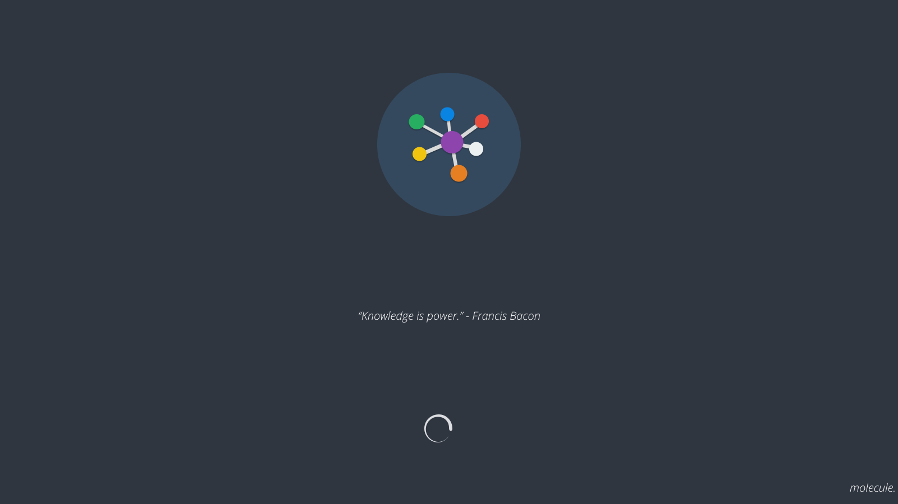

# design of splashscreen
Not that Molecule has long loading times, but a splash screen is always nice.

## faq

### why splashscreen?
Flutter applications always seem to have slight "loading inhibitions". To overcome this minor cosmetic inconvenience, there is a loading screen that is displayed for a certain duration. *(can be turned off)*

### quotes and jokes?
I thought it would be a pretty cool feature to have a short quote or joke displayed during the loading screen. *(can be edited or turned off)*

## Settings

